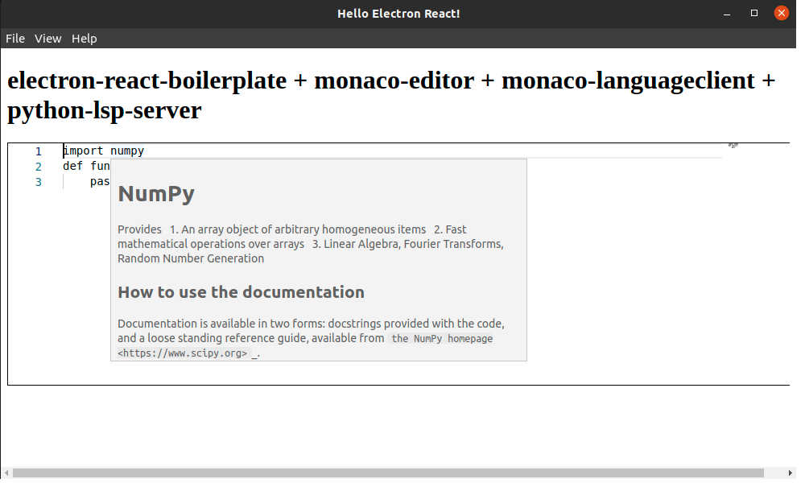

# Electron with monaco-editor, python-lsp-server, monaco-languageclient

Electron based on https://github.com/electron-react-boilerplate/electron-react-boilerplate


## python-lsp-server

Open new terminal window and create directory for lsp server. Create virtualenv:

```
virtuelenv venv
source venv/bin/activate
```

Install:

```
pip install python-lsp-server
pip install python-lsp-server[yapf]
pip install numpy
```

Output from `pip freeze`:

```
jedi==0.17.2
numpy==1.21.4
parso==0.8.2
pluggy==1.0.0
python-lsp-jsonrpc==1.0.0
python-lsp-server==1.3.1
ujson==4.3.0
yapf==0.31.0
```

I've used Python 3.8.10 on Ubuntu 20.04.

After installation check the `pylsp` path:

```
which pylsp
```

My path is:

```
/home/piotr/sandbox/example/pyls/venv/bin/pylsp
```

## Start electron app

Open new terminal and clone the project:

```
git clone git@github.com:pplonski/electron-monaco-python-lsp.git
```

Install package:

```
npm install
```

You will get some errors after installation (please ignore for now, I will fix them soon)

Run app:

```
npm start
```

You should see:




The console output:

```
npm start

> electron-react-boilerplate@ start /home/piotr/sandbox/example/electron-monaco-python-lsp
> ts-node ./.erb/scripts/check-port-in-use.js && npm run start:renderer


> electron-react-boilerplate@ start:renderer /home/piotr/sandbox/example/electron-monaco-python-lsp
> cross-env NODE_ENV=development TS_NODE_TRANSPILE_ONLY=true webpack serve --config ./.erb/configs/webpack.config.renderer.dev.ts

Starting Main Process...
<i> [webpack-dev-server] Project is running at:
<i> [webpack-dev-server] Loopback: http://localhost:1212/
<i> [webpack-dev-server] On Your Network (IPv4): http://192.168.1.197:1212/
<i> [webpack-dev-server] Content not from webpack is served from '/home/piotr/sandbox/example/electron-monaco-python-lsp/public' directory
<i> [webpack-dev-server] 404s will fallback to '/index.html'

> electron-react-boilerplate@ start:main /home/piotr/sandbox/example/electron-monaco-python-lsp
> cross-env NODE_ENV=development electron -r ts-node/register/transpile-only ./src/main/main.ts

App listening on port 8999
(node:27079) ExtensionLoadWarning: Warnings loading extension at /home/piotr/.config/Electron/extensions/fmkadmapgofadopljbjfkapdkoienihi:
  Unrecognized manifest key 'browser_action'.
  Unrecognized manifest key 'minimum_chrome_version'.
  Unrecognized manifest key 'update_url'.
  Cannot load extension with file or directory name _metadata. Filenames starting with "_" are reserved for use by the system.

(Use `electron --trace-warnings ...` to show where the warning was created)
10:26:23.174 › APPIMAGE env is not defined, current application is not an AppImage
<i> [webpack-dev-middleware] wait until bundle finished: /index.html
IPC test: ping
server on upgrade
{ pathname: '/index.html/monacoServer' }
{ state: 1, open: 1 }
connection established
Not rewriting GET /editor.worker.bundle.js because the path includes a dot (.) character.
server forward
JSON Server: 2021-11-23 10:26:34,848 CET - WARNING - pylsp.config.config - Failed to load pylsp entry point 'autopep8': No module named 'pycodestyle'

JSON Server: 2021-11-23 10:26:34,856 CET - WARNING - pylsp.config.config - Failed to load pylsp entry point 'mccabe': No module named 'mccabe'

JSON Server: 2021-11-23 10:26:34,857 CET - WARNING - pylsp.config.config - Failed to load pylsp entry point 'pycodestyle': No module named 'pycodestyle'

JSON Server: 2021-11-23 10:26:34,857 CET - WARNING - pylsp.config.config - Failed to load pylsp entry point 'pydocstyle': No module named 'pydocstyle'

JSON Server: 2021-11-23 10:26:34,858 CET - WARNING - pylsp.config.config - Failed to load pylsp entry point 'pyflakes': No module named 'pyflakes'

JSON Server: 2021-11-23 10:26:34,859 CET - WARNING - pylsp.config.config - Failed to load pylsp entry point 'pylint': No module named 'pylint'

JSON Server: 2021-11-23 10:26:34,859 CET - WARNING - pylsp.config.config - Failed to load pylsp entry point 'rope_completion': No module named 'rope'

JSON Server: 2021-11-23 10:26:34,860 CET - WARNING - pylsp.config.config - Failed to load pylsp entry point 'rope_rename': No module named 'rope'

server forward
server forward
server forward
server forward
server forward
server forward
server forward
server forward
server forward
server forward
server forward

```


## python-lsp-server

Python LSP server is launched in main process.


## Problems to be fixed:

- errors after `npm install`
- Failed to load resource: the server responded with a status of 404 (Not Found) - cant load `editor.worker.bundle.js` 